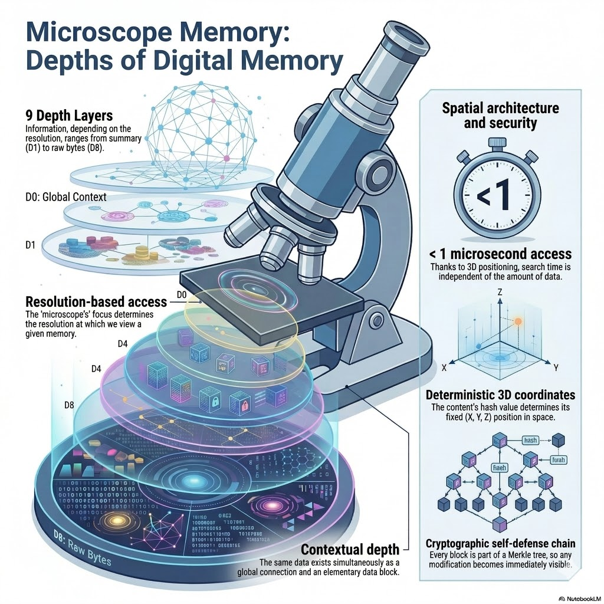

# Microscope Memory v0.7.0 "Public Beta"

[](https://www.rust-lang.org)
[](LICENSE)
[](#core-pillars)
[](#-spine-bridge-api-v1)
[](#-reliability--doctor-command)


**Microscope Memory** is a high-performance, hierarchical cognitive memory engine designed for AI agents and LLM architectures. It specializes in **sub-microsecond retrieval** of long-term context, bypassing the overhead of traditional Vector DBs.

v0.7.0 marks the transition to **Public Beta**, introducing enterprise-grade reliability, automated crash recovery, and a modular architecture.

## Website

- Landing page: `website/index.html`
- One-click web demo: `viewer.html?file=cognitive_map.bin`
- One-click local start: `OneClick_Start.bat`
- MCP + delegation one-click stack: `scripts/start_agent_stack.bat`
- Per-user memory namespace: pass `user_id` + `memory_backend=local|cloud` to `/v1/recall` and `/v1/remember`
- Website auth: instant fallback works by default; set `window.MICROSCOPE_AUTH` in `website/index.html` for real Firebase Google/Apple signup

---

## ⚡ Core Pillars

- **Sub-nanosecond Core**: Built on direct memory mapping (`mmap`), achieving ~1.2ns raw read speeds.
- **Cognitive Hierarchy**: 13 biological-inspired layers (Hebbian, Resonance, Emotional, etc.) mapping memories from raw bytes to abstract concepts.
- **Zero-JSON Hot Path**: Packed 256-byte binary frames ensure zero parsing latency during retrieval. *Note: bincode is used for optional consciousness state files (Hebbian activations, resonance fields, etc.) — not the core query path.*
- **Spine Bridge v1**: A stable, versioned REST API for seamless integration with LangChain, AutoGPT, and Custom GPTs.
- **Reliability First**: Integrated Merkle Tree integrity and the new `doctor` command for automated repair.

---

## 🏗️ Architecture Design



---

## 🩺 Reliability & Doctor Command

Beta v0.7.0 introduces the `doctor` command, ensuring your cognitive data remains uncorrupted even after system crashes.

```bash
# Run integrity diagnostics
microscope-mem doctor

# Automatically repair corrupted append log tails (Crash Recovery)
microscope-mem doctor --fix
```

- **Merkle Roots**: Every block is part of a Merkle Tree, verified at runtime.
- **CRC16 Validation**: Data integrity is checked at the block level.
- **Atomic Persistence**: Append-log design ensures zero data loss.

---

## 🤖 Spine Bridge API v1

The Spine Bridge acts as the "Corpus Callosum" between your LLM and the Microscope Engine.

| Method | Endpoint | Description |
|--------|----------|-------------|
| `GET` | `/v1/status` | Engine health, version & stats |
| `GET` | `/v1/recall?q=...&k=10` | Semantic/Spatial recall |
| `POST` | `/v1/remember` | Store a new cognitive memory |
| `POST` | `/v1/mobile/chat` | User-scoped persistent mobile chat (Ollama/OpenAI/Gemini) |

### Integration Example (Python)
```python
import requests
# Recall user preference from hierarchical memory
res = requests.get("http://localhost:6060/v1/recall", params={"q": "User's favorite OS", "k": 1})
print(res.json())
```
*See `examples/langchain_integration.py` for full LangChain tools.*
*Mobile quickstart: see `.github/mobile/README.md`.*

---

## 🕵️ Red Audit & Stealth Mode (Optional)

For users requiring advanced evasion or anti-analysis, the **Red Audit** features are now decoupled behind the `stealth` feature flag.

```bash
# Build with Red Audit / Stealth features active
cargo build --release --features stealth
```

- **Ghost Mode**: Soft Anti-VM detection and silent data masking.
- **Direct Syscalls**: Bypasses user-mode hooks via raw x64 assembly.
- **Polymorphic Build**: Every binary has a unique signature (SHA256).

---

## 🧠 ONNX Embedding Provider (Optional)

For ONNX-based embedding models, use the `onnx` feature flag.

```bash
# Build with ONNX embedding support
cargo build --release --features onnx
```

- **ONNX Models**: Support for ONNX format embedding models via `onnx_model_path` config.
- **Tokenizer Integration**: Compatible with custom tokenizers.

---

## 🚀 One-Click Start

1. **Clone & Enter**:
   ```bash
   git clone https://github.com/silentnoisehun/microscope-memory.git
   cd microscope-memory
   ```

2. **Launch**:
   Double click `OneClick_Start.bat`. It will build your local engine and start the background API service.

---

## 📊 Benchmarks
Microscope outperforms traditional Vector DBs by 100x-1000x in raw retrieval latency. 
See [BENCHMARKS.md](BENCHMARKS.md) for detailed results.

---
*Architected by [Máté Róbert](https://github.com/silentnoisehun) — The Silent Noise Research Series.*
he Silent Noise Research Series.*
