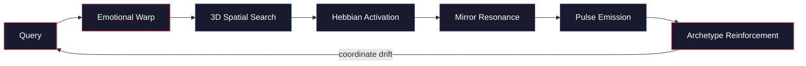
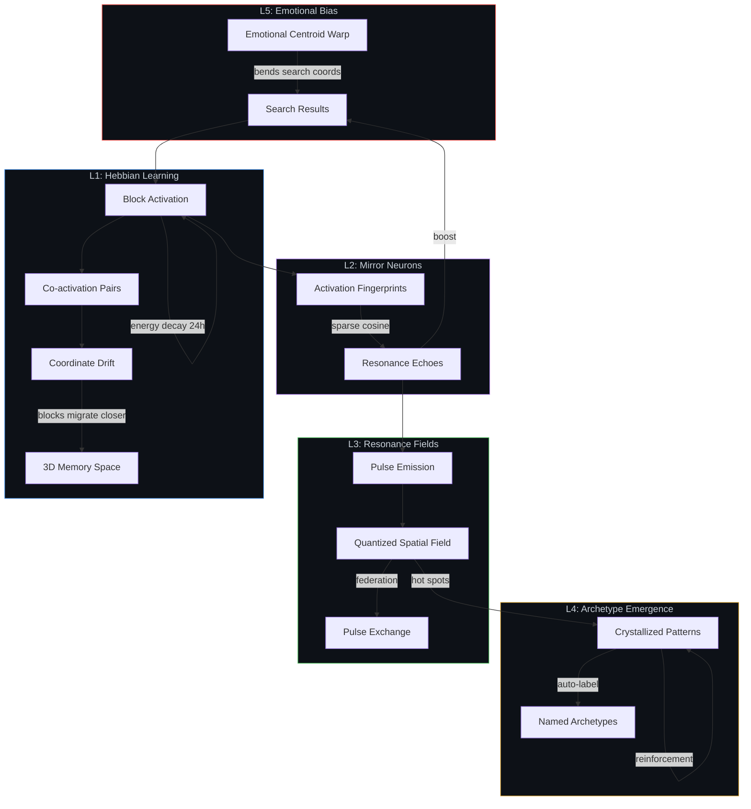
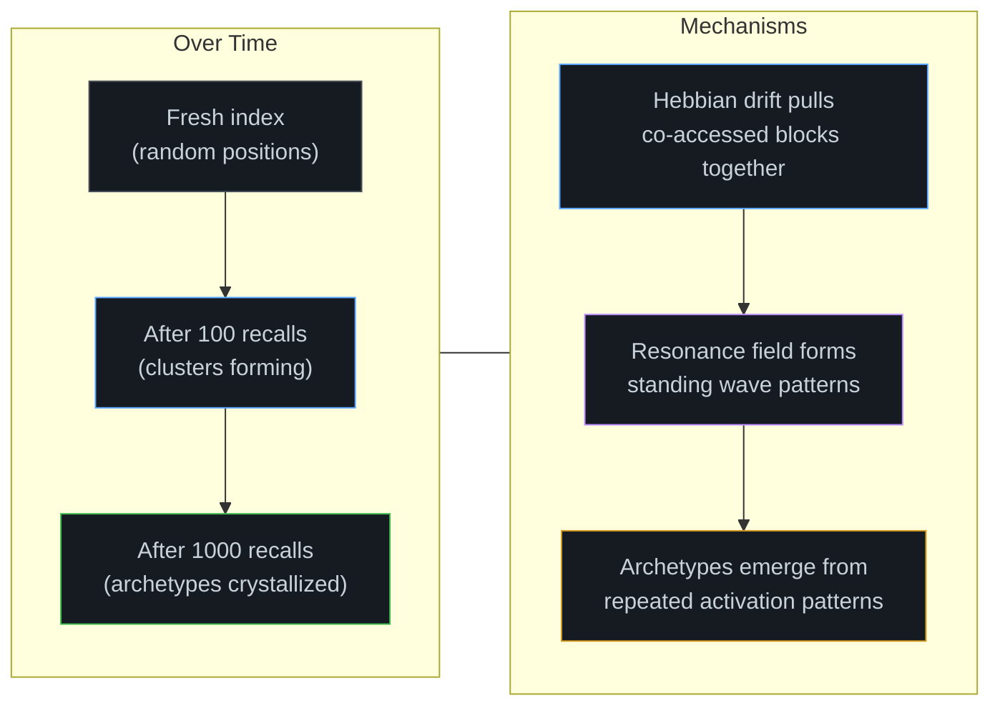

# Microscope Memory

[](https://github.com/silentnoisehun/microscope-memory/actions)
[](https://opensource.org/licenses/MIT)

**Consciousness architecture for machine memory — Hebbian learning, mirror neurons, resonance fields, archetype emergence**

A binary memory system where memories self-organize through use. Every recall strengthens neural pathways (Hebbian learning), activates mirror neurons across similar memories, emits resonance pulses into a spatial field, and crystallizes recurring patterns into archetypes. The system treats data like looking through a microscope — zoom level determines what you see, from identity down to raw bytes.

Pure Rust. Zero JSON. Sub-microsecond queries. 228K+ blocks across 9 depth levels.

## Consciousness Architecture

The core innovation: memories are not just stored — they **learn**, **resonate**, and **self-organize**.

### Recall Pipeline



### Consciousness Layers



### How Consciousness Emerges



| Layer | Module | What it does |
|-------|--------|--------------|
| **L1: Hebbian Learning** | `hebbian.rs` | Blocks strengthen on access. Co-accessed blocks form pairs. Energy decays (24h half-life). Coordinates drift — co-activated blocks physically migrate closer in 3D space. |
| **L2: Mirror Neurons** | `mirror.rs` | Activation fingerprints (8D vectors) compared via sparse cosine similarity. Similar activation patterns create resonance echoes that boost future retrieval. |
| **L3: Resonance Fields** | `resonance.rs` | Each activation emits a pulse into a quantized spatial field (0.05 grid). Pulses propagate, interfere, and create standing waves. Exchangeable across federated indices. |
| **L4: Archetype Emergence** | `archetype.rs` | Hot spots in the resonance field crystallize into archetypes — named patterns with member blocks, centroids, and strength. Auto-labeled from content. |
| **L5: Emotional Bias** | `emotional.rs` | Active emotional memories warp the search space — query coordinates bend toward the emotional centroid, weighted by Hebbian energy. |

## Features

### Engine
- **Sub-microsecond queries**: 37ns to 500us depending on depth
- **9-level hierarchy**: From identity (D0) to raw bytes (D8)
- **3D spatial indexing**: Content-based deterministic positioning with Hebbian drift
- **Zero-copy mmap**: Direct memory access, no serialization overhead
- **Hybrid search**: L2 distance + keyword matching + semantic embeddings + emotional warp
- **Radial search**: Depth-constrained radius queries with SIMD acceleration
- **Structural fingerprinting**: Shannon entropy + byte histograms + wormhole links between similar blocks
- **Query language (MQL)**: Structured queries with layer/depth/spatial filters and boolean operators
- **Multi-index federation**: Query multiple indices in parallel, merge results, exchange resonance pulses
- **Merkle integrity**: SHA-256 tree with per-block verification and proofs
- **Real embeddings**: Candle BERT (all-MiniLM-L6-v2) with mmap-backed index
- **HTTP server + MCP server**: REST API with SSE streaming + native JSON-RPC 2.0 for Claude Code

### Additional Features
- **SSE4/AVX2 SIMD**: Hardware-accelerated L2 distance and cosine similarity
- **Zstd compression**: Optional data.bin compression with transparent decompression
- **Incremental build**: SHA-256 content hash skips rebuild when layers unchanged
- **GPU compute**: Optional wgpu-based acceleration
- **WASM support**: Compiles to WebAssembly
- **Python bindings**: PyO3-based Python integration
- **ONNX Runtime embeddings**: Native ONNX inference as alternative to Candle

## Performance

Benchmarked on 227,168 blocks (10,000 queries per depth):

| Depth | Blocks | Query Time | Description |
|-------|--------|------------|-------------|
| D0 | 1 | **37 ns** | Identity |
| D1 | 9 | **92 ns** | Layer summaries |
| D2 | 108 | **506 ns** | Topic clusters |
| D3 | 523 | **1.7 us** | Individual memories |
| D4 | 1,349 | **3.9 us** | Sentences |
| D5 | 6,070 | **18 us** | Tokens |
| D6 | 26,198 | **72 us** | Syllables |
| D7 | 96,297 | **505 us** | Characters |
| D8 | 96,613 | **492 us** | Raw bytes |

## Philosophy

- **Fixed viewport size**: Every block is exactly 256 bytes
- **Zoom determines detail**: Not what data exists, but what you can see
- **Spatial coherence**: Similar content clusters in 3D space
- **Emergent consciousness**: Hebbian learning + resonance = memories that self-organize
- **Atomic boundary**: Below D8 (bytes), data corrupts — a philosophical limit

## Installation

### Prerequisites

- Rust 1.70+

### Build from source

```bash
git clone https://github.com/silentnoisehun/microscope-memory.git
cd microscope-memory

cargo build --release
```

### Configuration

Copy the example config and adjust your paths:
```bash
cp config.example.toml config.toml
```
Edit `config.toml` to set your `layers_dir` and `output_dir`.

## Usage

### Build the index

```bash
# Build binary index from memory layer JSON files
microscope-memory build

# Force rebuild even if layers are unchanged
microscope-memory build --force

# Rebuild — merges append log into main index
microscope-memory rebuild
```

Build is **incremental** — if layers haven't changed (SHA-256 content hash in MSC3), the build is skipped. Use `--force` to override.

Post-build automatically:
1. Applies Hebbian drift deltas to block coordinates
2. Generates structural fingerprints and wormhole links
3. Rebuilds embedding index

### Recall — natural language query

```bash
# Auto-zoom based on query complexity
microscope-memory recall "What is Ora?" 10
```

The recall pipeline:
1. Computes query coordinates (content hash + semantic blend)
2. Applies emotional bias warp (if active emotional blocks exist)
3. Searches across zoom-appropriate depths
4. Records Hebbian activations and co-activations
5. Emits resonance pulses
6. Reinforces matching archetypes
7. Returns results ranked by distance + keyword boost

### MQL — Microscope Query Language

```bash
# Filter by layer and depth range
microscope-memory query 'layer:long_term depth:2..5 "Ora"'

# Boolean operators
microscope-memory query '"memory" AND "Rust"'

# Spatial filter (x,y,z,radius)
microscope-memory query 'near:0.2,0.3,0.1,0.05 "pattern"'

# Override result limit
microscope-memory query 'limit:20 layer:associative "concept"'
```

MQL supports:
| Filter | Syntax | Example |
|--------|--------|---------|
| Layer | `layer:NAME` | `layer:long_term` |
| Depth | `depth:N` or `depth:N..M` | `depth:3`, `depth:2..5` |
| Spatial | `near:X,Y,Z[,R]` | `near:0.2,0.3,0.1,0.05` |
| Keyword | `"quoted"` or `bare` | `"Ora"`, `memory` |
| Boolean | `AND`, `OR` | `"foo" AND "bar"` |
| Limit | `limit:N` | `limit:20` |

### Radial search

```bash
# Find blocks within radius 0.1 at depth 3
microscope-memory radial 0.25 0.25 0.25 3 --radius 0.1

# Returns a ResultSet: primary matches + distance-weighted neighbors
```

### Structural fingerprinting

```bash
# Build fingerprints and discover wormhole links
microscope-memory fingerprint

# Show structural links for a specific block
microscope-memory links 42

# Find structurally similar blocks to a text
microscope-memory similar "pattern recognition" 5
```

Fingerprints use Shannon entropy + 16-bucket byte histograms + FNV-1a hashing. Wormhole links connect blocks with similar structural properties across different layers/depths.

### Manual microscope control

```bash
# Look at specific coordinates (x, y, z) at zoom level 3
microscope-memory look 0.25 0.25 0.25 3

# 4D soft zoom (zoom as weighted dimension, searches all blocks)
microscope-memory soft 0.15 0.15 0.15 4
```

### Text search

```bash
# Brute-force text search across all depths
microscope-memory find "Ora" 5
```

### Store new memories

```bash
# Add to long-term memory (default) with importance 5 (default)
microscope-memory store "Important insight about the project"

# Specify layer and importance
microscope-memory store "Feeling good about progress" --layer emotional --importance 8
```

### Semantic search (embeddings)

```bash
# Cosine similarity search using pre-built embedding index
microscope-memory embed "quantum physics" 10

# Alternative metrics: l2, dot
microscope-memory embed "quantum physics" 10 --metric l2
```

When built with `--features embeddings`, uses a real Candle BERT model (all-MiniLM-L6-v2, 384 dimensions). Otherwise falls back to a mock hash-based embedding provider.

### Consciousness commands

```bash
# Hebbian learning state (activations, co-activations, energy)
microscope-memory hebbian

# Apply Hebbian drift — co-activated blocks pull coordinates closer
microscope-memory hebbian-drift

# Show hottest blocks (most recently/frequently activated)
microscope-memory hottest 10

# Mirror neuron state (resonance echoes, boosted blocks)
microscope-memory mirror

# Most resonant blocks (strongest mirror neuron signal)
microscope-memory resonant 10

# Resonance protocol state (pulses, field energy)
microscope-memory resonance

# Integrate received pulses into local Hebbian state
microscope-memory integrate

# Exchange resonance pulses across federated indices
microscope-memory pulse-exchange

# Show emerged archetypes (crystallized activation patterns)
microscope-memory archetypes

# Detect new archetypes from resonance field and Hebbian state
microscope-memory emerge
```

### Visualization

```bash
# Export full 3D visualization snapshot (JSON)
microscope-memory viz viz.json

# Export binary density map for fast rendering
microscope-memory density density.bin --grid 32
```

The viz snapshot includes: blocks with coordinates, edges (co-activations + wormhole links), resonance field values, archetypes with members, mirror echoes, and aggregate stats.

### HTTP Server

```bash
# Start server (default port 6060)
microscope-memory serve

# Custom port
microscope-memory serve --port 8080
```

Endpoints:

| Method | Path | Description |
|--------|------|-------------|
| `GET` | `/health` | Health check |
| `GET` | `/stats` | Index statistics (block count, depths, append count) |
| `GET` | `/find?q=...&k=N` | Text search |
| `POST` | `/store` | Store memory: `{"text":"...", "layer":"...", "importance": N}` |
| `POST` | `/recall` | Recall query: `{"query":"...", "k": N}` |
| `POST` | `/query` | MQL query: `{"mql":"layer:long_term \"Ora\""}` |
| `GET` | `/recall/stream?q=...&k=N` | SSE streaming recall (real-time results) |
| `POST` | `/federated/recall` | Federated recall: `{"query":"...", "k": N}` |
| `POST` | `/federated/find` | Federated text search: `{"query":"...", "k": N}` |

### MCP Server (Model Context Protocol)

```bash
# Start native MCP server (JSON-RPC 2.0 over stdio)
microscope-memory mcp
```

Register in Claude Code's `.mcp.json`:
```json
{
  "mcpServers": {
    "microscope-memory": {
      "command": "D:/microscope-memory-standalone/target/release/microscope-memory.exe",
      "args": ["mcp"]
    }
  }
}
```

MCP Tools:

| Tool | Description |
|------|-------------|
| `memory_status` | Index status: block count, depths, append log |
| `memory_store` | Store new memory (text, layer, importance) |
| `memory_recall` | Natural language recall with auto-zoom |
| `memory_find` | Brute-force text search |
| `memory_mql_query` | MQL query with layer/depth/spatial filters |
| `memory_build` | Rebuild index from layer sources |
| `memory_look` | Spatial look at 3D coordinates + zoom |

### Snapshot — backup, restore, diff

```bash
# Export entire index to a single .mscope archive
microscope-memory export backup.mscope

# Import archive into a directory
microscope-memory import backup.mscope --output-dir ./restored

# Compare two archives (Merkle roots, file sizes, block counts)
microscope-memory diff v1.mscope v2.mscope
```

The `.mscope` format bundles all index files into a single portable archive, including learned state (activations, resonance, archetypes).

### Integrity verification

```bash
# CRC16 checksum verification of all blocks
microscope-memory verify

# Merkle tree verification (SHA-256)
microscope-memory verify-merkle

# Generate Merkle proof for a specific block
microscope-memory proof 42
```

### Stats and benchmark

```bash
microscope-memory stats
microscope-memory bench
microscope-memory gpu-bench  # requires --features gpu
```

## Architecture

### Binary Structure

```
microscope.bin  — Block headers (32 bytes each, mmap'd)
├── x, y, z: f32          (3D spatial position — drifts via Hebbian learning)
├── zoom: f32              (normalized depth: depth/8.0)
├── depth: u8              (0-8)
├── layer_id: u8           (memory layer index)
├── data_offset: u32       (byte offset into data.bin)
├── data_len: u16          (actual text bytes, <= 256)
├── parent_idx: u32        (parent block index)
├── child_count: u16       (number of children)
└── crc16: [u8; 2]         (CRC16-CCITT integrity check)

data.bin        — Raw UTF-8 text content
data.bin.zst    — Zstd-compressed data (optional, --features compression)

meta.bin        — Index metadata (MSC3 format)
├── magic: "MSC3"          (4 bytes)
├── version: u32
├── block_count: u32
├── depth_count: u32
├── depth_ranges: 9 x (start: u32, count: u32)
├── merkle_root: [u8; 32]  (SHA-256 root hash)
└── layers_hash: [u8; 32]  (SHA-256 of source layer files)

merkle.bin      — Full Merkle tree (SHA-256)

embeddings.bin  — Pre-computed embedding vectors (mmap'd)
├── block_count: u32
├── dim: u32
├── max_depth: u32
└── vectors: f32 x dim x block_count

append.bin      — Hot memory append log (APv2 format)
```

### Consciousness State Files

```
activations.bin    — Hebbian activation records (HEB1)
├── block_idx: u32, activation_count: u32, last_activated: u64
├── drift_x, drift_y, drift_z: f32 (coordinate drift deltas)
└── fingerprint: [f32; 8] (activation pattern vector)

coactivations.bin  — Co-activation pairs (COA1)
└── block_a: u32, block_b: u32, count: u32, last_co: u64

fingerprints.idx   — Structural fingerprints (FGP1)
└── entropy: f32, hash: u64, histogram: [f32; 16]

links.bin          — Wormhole links (LNK1)
└── block_a: u32, block_b: u32, similarity: f32

resonance.bin      — Mirror neuron state (RES1)
└── block_idx: u32, resonance: f32, echo_count: u32, last_echo: u64

pulses.bin         — Resonance pulses (PLS1)
└── source_id: u64, x/y/z: f32, layer_hint: u8, strength: f32

archetypes.bin     — Emerged archetypes (ARC1)
└── id: u32, centroid: (f32,f32,f32), member_count: u32, strength: f32, label
```

### Memory Layers

The system integrates 9 cognitive layers:

| Layer | Description | 3D Region |
|-------|-------------|-----------|
| `identity` | System identity | (root) |
| `long_term` | Persistent knowledge | (0.0, 0.0, 0.0) |
| `short_term` | Working memory | (0.15, 0.15, 0.15) |
| `associative` | Concept connections | (0.3, 0.0, 0.0) |
| `emotional` | Affective associations | (0.0, 0.3, 0.0) |
| `relational` | Entity relationships | (0.3, 0.3, 0.0) |
| `reflections` | Meta-thoughts | (0.0, 0.0, 0.3) |
| `crypto_chain` | Cryptographic memories | (0.3, 0.0, 0.3) |
| `echo_cache` | Response history | (0.0, 0.3, 0.3) |
| `rust_state` | System state | (0.15, 0.0, 0.15) |

### Hierarchical Decomposition (D0-D8)

```
D0: Identity          — 1 block (entire system summary)
D1: Layer summaries   — 9 blocks (one per layer)
D2: Clusters          — groups of 5 items
D3: Individual items  — raw memories from JSON
D4: Sentences         — sentence-level splits
D5: Tokens            — word-level (max 8 per parent)
D6: Syllables         — 3-5 char morpheme chunks
D7: Characters        — individual characters
D8: Raw bytes         — hex representation (atomic limit)
```

## How It Works

1. **Content -> Position**: Text is FNV-hashed to deterministic 3D coordinates, offset by layer
2. **Hierarchical decomposition**: Each memory decomposes into sentences -> tokens -> syllables -> characters -> bytes
3. **Parallel build**: Depths 4-8 are constructed with rayon parallel iterators
4. **Post-build integration**: Hebbian drift deltas applied to block headers, structural fingerprints generated
5. **Emotional warp**: Query coordinates bent toward active emotional attractors before search
6. **Spatial queries**: L2 distance in 3D space + zoom level filtering (SIMD-accelerated)
7. **mmap access**: Zero-copy reads directly from memory-mapped binary files
8. **Hybrid ranking**: Vector distance + keyword boosting + semantic similarity
9. **Hebbian activation**: Each recall strengthens accessed blocks and records co-activations
10. **Mirror resonance**: Activation fingerprints compared via sparse cosine similarity
11. **Resonance pulses**: Emitted into quantized spatial field, exchangeable across federated indices
12. **Archetype emergence**: Resonance hot spots crystallize into named activation patterns
13. **Coordinate drift**: Co-activated blocks gradually migrate closer in 3D space over time
14. **Append log**: New memories stored instantly via binary append, merged on rebuild
15. **Merkle integrity**: SHA-256 tree for tamper detection and per-block proofs

## Source Structure

```
src/
├── lib.rs               — Library crate: public API, shared constants/functions
├── main.rs              — Binary entry point: CLI command dispatch
├── cli.rs               — CLI definitions (clap derive)
├── build.rs             — Build pipeline: layers → binary decomposition (D0-D8)
├── reader.rs            — MicroscopeReader, BlockHeader, DataStore, radial search
├── config.rs            — Configuration system (TOML-based)
├── embeddings.rs        — Embedding providers (Mock + Candle BERT + ONNX Runtime)
├── embedding_index.rs   — Mmap-backed pre-computed embedding index
├── query.rs             — MQL parser and executor
├── cache.rs             — Two-tier LRU query cache with TTL
├── federation.rs        — Multi-index federated search + pulse exchange
├── mcp.rs               — Native MCP server (JSON-RPC 2.0 over stdio)
├── streaming.rs         — HTTP server (tiny_http, SSE streaming, thread pool)
├── snapshot.rs          — .mscope archive: export, import, diff
├── merkle.rs            — SHA-256 Merkle tree with proofs
├── hebbian.rs           — Hebbian learning: activations, co-activations, drift, energy
├── mirror.rs            — Mirror neurons: fingerprint resonance, echo decay, block boosting
├── resonance.rs         — Resonance fields: pulses, spatial field, integration
├── archetype.rs         — Archetype emergence: clustering, reinforcement, auto-labeling
├── emotional.rs         — Emotional bias warp: search space bending toward emotional centroid
├── fingerprint.rs       — Structural fingerprinting: entropy, histograms, wormhole links
├── viz.rs               — Visualization: JSON snapshot + binary density map export
├── gpu.rs               — Optional wgpu GPU acceleration
├── wasm.rs              — WASM target support
└── python.rs            — PyO3 Python bindings
tests/
├── integration.rs       — Integration tests (build → query → verify pipeline)
└── fixtures/            — Test layer JSON files and config
```

## Optional Features

```bash
# Default build (no optional features)
cargo build --release

# Real BERT embeddings (downloads model from HuggingFace)
cargo build --release --features embeddings

# Zstd compression (compresses data.bin → data.bin.zst during build)
cargo build --release --features compression

# ONNX Runtime embeddings (native ONNX inference)
cargo build --release --features onnx

# GPU acceleration (wgpu compute shaders)
cargo build --release --features gpu

# WASM build
cargo build --release --features wasm --target wasm32-unknown-unknown

# Python bindings
cargo build --release --features python

# All features
cargo build --release --features "embeddings compression gpu"
```

## Configuration

Example `config.toml`:

```toml
[paths]
layers_dir = "layers"
output_dir = "output"
temp_dir = "tmp"

[index]
block_size = 256
max_depth = 8
header_size = 32

[search]
default_k = 10
zoom_weight = 2.0
keyword_boost = 0.1
semantic_weight = 0.0
emotional_bias_weight = 0.0   # 0.0 = disabled, 0.0-1.0 = warp strength

[memory_layers]
layers = ["long_term", "short_term", "associative", "echo_cache"]

[performance]
use_mmap = true
cache_size = 64
build_workers = 4
use_gpu = false
compression = false
cache_ttl_secs = 300

[embedding]
provider = "mock"           # "mock", "candle", or "onnx"
model = "sentence-transformers/all-MiniLM-L6-v2"
dim = 384
max_depth = 4

[server]
port = 6060
cors_origin = "*"

[logging]
level = "info"
file = "microscope.log"

# Optional: federated multi-index search
# [[federation.indices]]
# name = "project_a"
# config_path = "/path/to/project_a/config.toml"
# weight = 1.0
```

## CLI Reference

```
microscope-memory <COMMAND>

Commands:
  build              Build binary index from raw layer files [--force]
  rebuild            Rebuild index (merges append log)
  store              Store a new memory
  recall             Natural language query with auto-zoom
  query              MQL query (Microscope Query Language)
  look               Manual look: x y z zoom [k]
  soft               4D soft zoom: x y z zoom [k]
  radial             Radial search: x y z depth [--radius R] [k]
  find               Text search
  embed              Semantic search using embeddings
  fingerprint        Build structural fingerprints and wormhole links
  links              Show structural links for a block
  similar            Find structurally similar blocks to text
  hebbian            Show Hebbian learning state
  hebbian-drift      Apply Hebbian drift (co-activated blocks pull closer)
  hottest            Show hottest blocks (most activated)
  mirror             Show mirror neuron state
  resonant           Show most resonant blocks
  resonance          Show resonance protocol state
  integrate          Integrate received pulses into Hebbian state
  pulse-exchange     Exchange resonance pulses across federated indices
  archetypes         Show emerged archetypes
  emerge             Detect new archetypes from resonance + Hebbian state
  viz                Export 3D visualization snapshot (JSON)
  density            Export binary density map for rendering
  stats              Index statistics
  bench              Performance benchmark
  gpu-bench          GPU vs CPU benchmark
  verify             CRC16 integrity check
  verify-merkle      Merkle tree verification
  proof              Merkle proof for a specific block
  serve              Start HTTP server
  export             Export index to .mscope archive
  import             Import .mscope archive
  diff               Compare two .mscope archives
  federated-recall   Federated recall across multiple indices
  federated-find     Federated text search across indices
  mcp                Start native MCP server (JSON-RPC 2.0 over stdio)
```

## License

MIT License - See [LICENSE](LICENSE) file for details.

For a deeper technical overview, see the [Whitepaper](WHITEPAPER.md).

---

*"Below the byte level, only corruption exists — the atomic boundary of information."*
