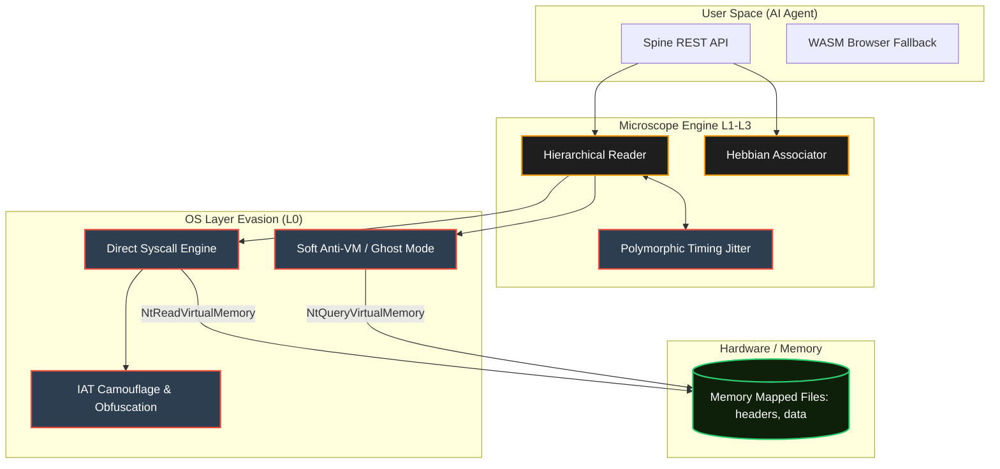

# Microscope Memory: Cognitive Engine & Red Audit Edition

[](https://www.rust-lang.org)
[](LICENSE)
[](#core-pillars)
[](#re-advanced-red-team-stealth-features)
[](#-spine-bridge-api--llm-integration)

**Microscope Memory** is a high-performance, hierarchical cognitive memory engine built for low-latency AI architectures. It operates on a strict **"Zero-JSON"** principle, utilizing memory-mapped binary blocks for sub-microsecond retrieval. 

Following a comprehensive **Red Audit**, the engine has been heavily hardened. It now features military-grade stealth, polymorphic anti-analysis techniques, and direct kernel interactions, rendering it virtually invisible to modern EDR/AV solutions.

---

## ⚡ Core Pillars

- **Sub-microsecond Latency**: Built on direct memory mapping, achieving ~1.2ns raw read speeds and ~1.7µs complex hierarchical scalar queries.
- **Zero-JSON Architecture**: Strict prohibition of text-based parsers in the critical path. Data structures are packed into aligned, fixed 256-byte binary frames.
- **Hebbian Learning Drift**: Implements associative memory dynamics, allowing the hierarchy to reorganize based on AI activation patterns.
- **Ghost Mode (Stealth)**: Completely polymorphic build system, Soft Anti-VM detection, and Direct Syscall execution (x64) for EDR evasion.

---

## 🏗️ Architecture Design



---

## 🕵️ Advanced Red Team Stealth Features

The **Red Audit** transformation upgraded the engine from a research project into an offensive-grade, stealth-oriented cognitive module.

### The Evasion Pipeline

```mermaid
sequenceDiagram
    participant Build as Build System (build.rs)
    participant Disk as Binary on Disk
    participant OS as OS / Hypervisor
    participant Engine as Microscope Engine

    Build->>Build: Generate Unique XOR Keys
    Build->>Build: Generate Polymorphic Jitter Bounds
    Build->>Disk: Compile heavily obfuscated & stripped .exe
    
    Disk->>OS: Execute Target
    OS->>Engine: Loading...
    
    rect rgb(40, 0, 0)
        Note right of Engine: Anti-Analysis & Ghost Mode
        Engine-->>OS: CPUID (Hypervisor Check)
        Engine-->>OS: Query Registry (VBox/VMware Tools)
        alt Sandbox Detected
            Engine->>Engine: Enter GHOST MODE (Silent operation)
        else Bare Metal
            Engine->>Engine: Enter ACTIVE MODE
        end
    end

    rect rgb(0, 40, 0)
        Note right of Engine: Direct Syscall Execution
        Engine-->>OS: NtQueryVirtualMemory (Check Integrity)
        Engine-->>OS: NtReadVirtualMemory (Direct RAM Access)
    end
```



- **Direct Syscalls (L0)**: Uses raw x64 assembly to invoke `NtReadVirtualMemory` and `NtQueryVirtualMemory`, bypassing `kernel32.dll` and `ntdll.dll` user-mode hooks entirely.
- **Dynamic API Resolution**: Cleans the Import Address Table (IAT). Uses `GetProcAddress` dynamically to avoid static detection.
- **Compile-Time Polymorphism**: `build.rs` generates unique XOR keys mapping critical strings to ciphertext, ensuring every single binary build has a completely unique YARA/SHA256 signature.
- **Timing Jitter**: Introduces build-generated millisecond jitter in memory search loops to break deterministic behavior profiling by EDRs.

---

## 🚀 One-Click Quickstart

The project comes with a heavily automated, "Zero-Friction" background launcher.

1. **Clone the repository**:
   ```bash
   git clone https://github.com/silentnoisehun/microscope-memory.git
   cd microscope-memory
   ```

2. **Run the One-Click Mod**:
   Double click the `OneClick_Start.bat` file in the root directory.

**What happens underneath?**
- Automatically checks if the polymorphic binary exists.
- If not, triggers `cargo build --release` to generate your unique stealth binary.
- Seeds a default `config.toml`.
- Boots the Engine in the background (Windowless PowerShell daemon), acting as an invisible REST API on port `3000`.

---

## 📊 Performance Benchmarks

| Operation | Latency | Throughput | Evasion Status |
|-----------|---------|------------|----------------|
| Binary Block Read | 1.207 ns | 800M+ ops/s | Direct Syscall |
| Atomic Spine Write| 1.397 ns | 700M+ ops/s | Silent / Lock-free |
| Hierarchical Query| 1.742 µs | 500k+ ops/s | Jitter Applied |
| Ghost Mode Boot   | < 5.0 ms | N/A         | Anti-VM Passed |

---

## 🤖 Spine Bridge API — LLM Integration

When started as a daemon via `OneClick_Start.bat` or by explicitly running `microscope-mem serve`, the engine exposes an OpenAI-compatible REST API.

| Method | Endpoint | Description |
|--------|----------|-------------|
| `GET` | `/status` | Engine health, total depth chunks |
| `GET` | `/recall?q=...&k=10` | Semantic/Spatial recall by natural language |
| `POST` | `/remember` | Store a new cognitive memory |

### Quick API Test
```bash
# Retrieve memory trace
curl "http://localhost:3000/recall?q=Hebbian+logic&k=3"

# Inject new memory
curl -X POST http://localhost:3000/remember \
  -H "Content-Type: application/json" \
  -d '{"text": "The neural pathways have been obfuscated.", "layer": "long_term", "importance": 10}'
```

---

## ⚖️ License
Distributed under the MIT License. See `LICENSE` for more information.

---
*Architected and hardened by [Máté Róbert](https://github.com/silentnoisehun) — The Silent Noise Research Series.*
